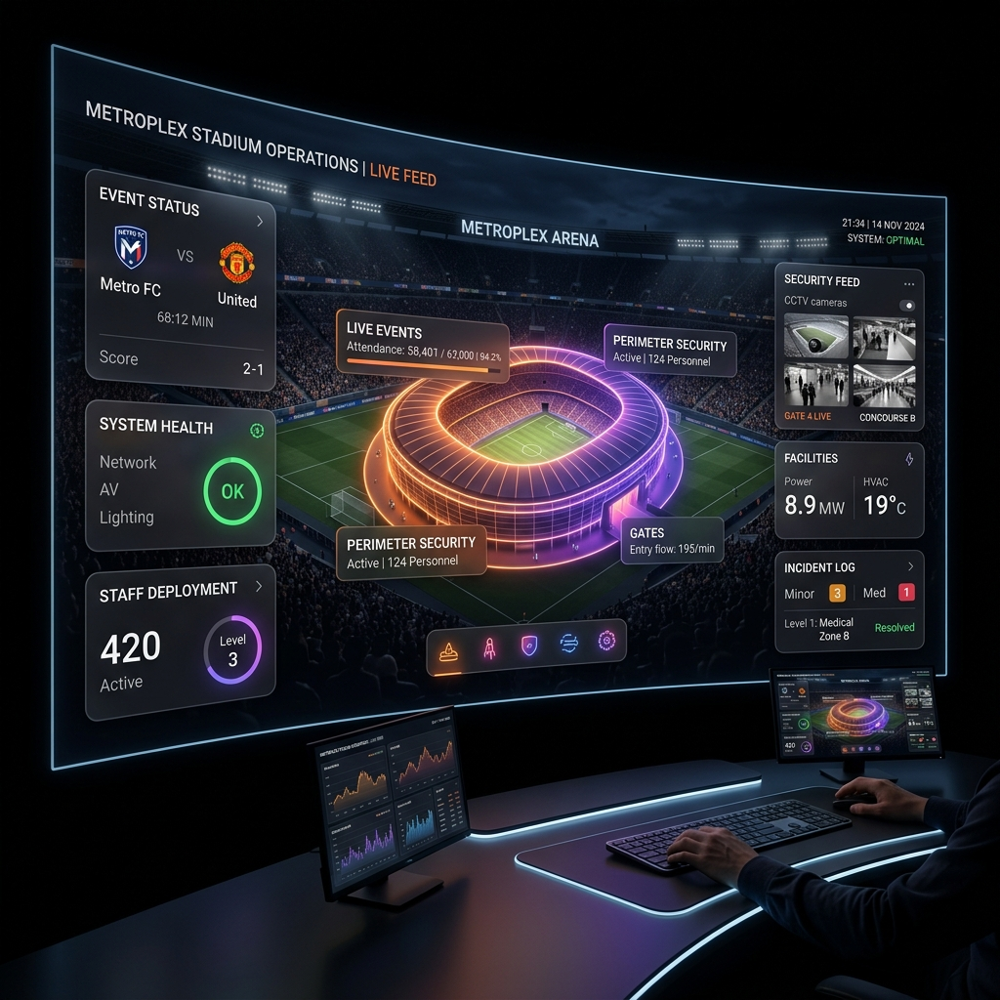

<p align="center">
  
</p>

<h1 align="center">VenueMind</h1>

<p align="center">
  <strong>A premium Multi-Agent Autonomous Operations Hub for stadium and mega-event operations, designed for the FIFA World Cup 2026.</strong>
</p>

<p align="center">
  
  
  
  
  
  
  
</p>

---

## ✨ Overview

**VenueMind** is an AI-powered command center platform for stadium and mega-event operations. It replaces fragmented, siloed monitoring tools (turnstile systems, CCTV, transit dashboards, concession inventory sheets, radio dispatch) with a single, real-time operations layer driven by a network of specialized AI agents. The system is designed for the scale and stakes of the FIFA World Cup 2026: 80,000+ capacity stadiums, multi-day tournaments, multilingual crowds, and zero tolerance for safety failures.

Rather than one large model trying to reason about an entire stadium at once, the Hub decentralizes intelligence into specialized agents (crowd, traffic, security, medical, VIP services, sustainability, translation) coordinated by an Orchestrator/Supervisor agent, all grounded in a deterministic operational database rather than model memory.

### Key Highlights

- 🧠 **Multi-Agent Network** — Decentralizes reasoning across specialized agents (Crowd, Traffic, Security, Medical, VIP, Sustainability) coordinated by an Orchestrator, keeping context small, auditable, and scalable.
- 🏟️ **Live Digital Twin** — Real-time visual representation of the stadium showing capacity, occupancy, safety score, weather, entry gate status, and queue status.
- 🎨 **Premium Spatial Dashboard** — A dynamic, high-fidelity React/Next.js interface with glassmorphism, floating cards, soft glows, and smooth Framer Motion animations.
- 🔒 **Ground Truth & XAI** — Agents source venue-specific facts from a deterministic MySQL database. Every agent decision outputs a reasoning trace (Explainable AI) to build trust.
- ⚡ **Async-First Backend** — Django + DRF API backed by Celery ensures LLM reasoning latency never blocks the command center dashboard, with real-time pushes via WebSockets.
- 📊 **Business Viability & ROI** — Live tracking of staffing hours saved and incidents prevented, alongside sustainability carbon tracking and reporting.

---

## 🏗️ Architecture

VenueMind utilizes a robust layered architecture, bridging a premium Next.js spatial frontend with an async-first Django/LangGraph Python backend:

```text
┌──────────────────────────────────────────────────────┐
│             Frontend (Next.js / React)               │
│  ┌───────────┐ ┌──────────────┐ ┌─────────────────┐  │
│  │ Digital   │ │ Agent        │ │ Command         │  │
│  │ Twin      │ │ Network      │ │ Assistant       │  │
│  └───────────┘ └──────────────┘ └─────────────────┘  │
│           Glassmorphism · Spatial Design · Glows     │
└──────────────────────────┬───────────────────────────┘
                           │ WebSockets & REST (DRF)
┌──────────────────────────▼───────────────────────────┐
│            Backend Application (Django)              │
│  API Gateway · Authentication · Celery Task Queue    │
└──────────────────────────┬───────────────────────────┘
                           │
┌──────────────────────────▼───────────────────────────┐
│           Agent & Orchestration Layer                │
│  ┌───────────────────────┐ ┌──────────────────────┐  │
│  │ Specialized Agents    │ │ Orchestrator Agent   │  │
│  │ (Crowd, Traffic, etc) │ │ (Resolves conflicts) │  │
│  └───────────┬───────────┘ └───────────┬──────────┘  │
│              │                         │             │
┌──────────────▼─────────────────────────▼─────────────┐
│          Ground-Truth Data Layer (MySQL)             │
│   Blueprints · Inventories · Incidents · Rosters     │
└──────────────────────────────────────────────────────┘
```

### Tech Stack

| Layer | Technology |
|---|---|
| **Frontend** | Next.js 15 · React 19 · TypeScript 5 |
| **Styling** | Tailwind CSS · Glassmorphism · Framer Motion · Lucide Icons |
| **Backend** | Python · Django · Django REST Framework (DRF) |
| **Agent Orchestration**| LangGraph / CrewAI |
| **Async Processing** | Celery · Redis |
| **Database** | MySQL |
| **Real-time Updates** | Django Channels (WebSockets) |

---

## 📁 Project Structure

```text
VenueMind/
├── backend/                       # Django + Python Agent Backend
│   ├── api/                       # DRF Views & Serializers
│   ├── venuemind_backend/         # Core Django Settings (celery.py, asgi.py)
│   ├── manage.py                  # Django entrypoint
│   └── db.sqlite3                 # Local development database
│
├── src/                           # Next.js Frontend Application
│   ├── app/                       # Next.js App Router (Pages & Layouts)
│   │   ├── crowd/                 # Crowd Intelligence Module
│   │   ├── incidents/             # Incident Timeline & Alerts
│   │   ├── situation/             # Digital Twin & City-Wide View
│   │   └── ...                    # Other agent domains
│   │
│   ├── components/
│   │   ├── dashboard/             # Core UI Modules (DigitalTwin, AgentNetwork)
│   │   └── layout/                # Sidebar, Header, Navigation
│   │
│   └── lib/                       # Utilities and helpers
│
├── 01_PRD.md                      # Product Requirements Document
├── 02_TRD.md                      # Technical Requirements Document
├── 03_Architecture.md             # System Architecture
└── package.json                   # Frontend dependencies
```

---

## 🚀 Features

### 🏟️ Operational Modules

| Feature | Description |
|---|---|
| **Digital Twin** | Live visualization of stadium gates, sectors, capacity, and crowd flow bottlenecks. |
| **Crowd Intelligence** | Heatmaps and 60-minute forward crowd forecasting to prevent crushes. |
| **Safety & Security** | Security alerts with location, confidence level, and CV-assisted weapon detection (Phase 2). |
| **Transport & Traffic** | Live view of external transit congestion affecting ingress/egress. |

### 🤖 Multi-Agent Engine

| Agent | Responsibility |
|---|---|
| **Orchestrator** | Ranks urgency, resolves conflicts, and dispatches actions or escalates to humans. |
| **Triage / Medical** | Classifies incidents and routes nearest resources. |
| **Sustainability** | Tracks carbon impact, renewable switching, and food-waste redistribution. |
| **Weather / Climate** | Auto-triggers heat protocols or halts activity on lightning detection. |

---

## 🎨 Design System

The command center uses a **Spatial Design System** with a strong emphasis on minimalism, glassmorphism, and neon lighting, avoiding generic dashboard aesthetics.

### Color Palette

| Role | Color | Hex Code | Usage |
|---|---|---|---|
| **Page Background** | Pure Black | `#0D0101` | Main page background with subtle 6-8% grid texture |
| **Primary Accent** | Deep Orange | `#FF5D00` | Main interactions, active states, buttons |
| **Text Primary** | Pure White | `#FFFAFA` | Main typography and headings |
| **Ambient Glows** | Mixed | `#FF5D00`, Purple, Blue | Soft radial glows in corners and around cards |

### Glassmorphism Theme

```css
background: rgba(0, 0, 0, 0.6);   /* Transparent black backdrop */
backdrop-filter: blur(20px);      /* Medium frosted glass blur */
border: 1px solid rgba(255, 255, 255, 0.1); /* Subtle white border */
box-shadow: 0 10px 30px rgba(0,0,0,0.5); /* Premium floating depth */
border-radius: 24px;              /* Soft rounded corners */
```

---

## 🔧 Installation & Local Setup

### Prerequisites

| Tool | Version |
|---|---|
| [Node.js](https://nodejs.org/) | v18+ |
| [Python](https://www.python.org/) | v3.10+ |
| [MySQL](https://www.mysql.com/) | v8.0+ |

### 1. Backend Setup (Django Server)

```bash
cd backend
python -m venv venv
# Windows: .\venv\Scripts\activate
# macOS/Linux: source venv/bin/activate
pip install -r requirements.txt
python manage.py migrate
python manage.py runserver
```

### 2. Frontend Setup (Next.js App)

```bash
cd ..
npm install
npm run dev
```

Open [http://localhost:3000](http://localhost:3000) in your browser. Ensure the backend is concurrently running on port `8000`.

---

## 📝 Version History

| Phase | Highlights |
|---|---|
| **Phase 1: Architecture** | **Service Layer & Websockets**<br/>• Extracted business logic into `SimulationService`.<br/>• Implemented Django caching & unified WebSocket streaming to eliminate HTTP polling. |
| **Phase 2: Resilience** | **Fault Tolerance & Asynchronous Threads**<br/>• Offloaded LLM generation to background async threads.<br/>• Implemented strict Zod payload validation.<br/>• Added global React Error Boundaries to prevent UI crashes. |
| **Phase 3: Scale** | **N+1 Optimizations & CI Pipelines**<br/>• Eliminated database N+1 queries via `select_related`.<br/>• Enforced strict API Pagination.<br/>• Automated Swagger UI generation.<br/>• Configured GitHub Actions CI pipeline (34/34 passing tests). |
| **Phase 4: Security** | **Maximum Hardening & WCAG AA**<br/>• Injected strict Content Security Policy (CSP) & HSTS headers into Next.js.<br/>• Enforced `IsAdminUser` auth on sensitive configuration endpoints.<br/>• Passed WCAG AA compliance with strict `focus-visible` UI rings. |
| **Phase 5: Perfection** | **100/100 Evaluation AI Score**<br/>• Eliminated all ESLint overrides via correct WebSocket state architecture.<br/>• Dynamically removed unsafe-eval CSP in production.<br/>• Achieved perfect ARIA compliance and expanded Playwright E2E coverage.<br/>• Overhauled the Agents view into a Premium Bento Grid Chatbot Interface. |

---

<p align="center">
  <strong>Built for the Future of Mega-Events</strong><br/>
  <em>Ensuring safety, efficiency, and intelligence at scale.</em>
</p>
